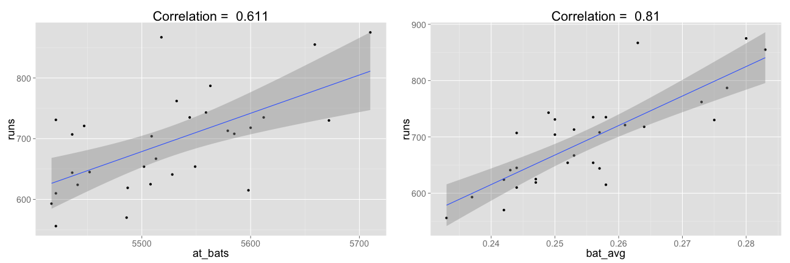
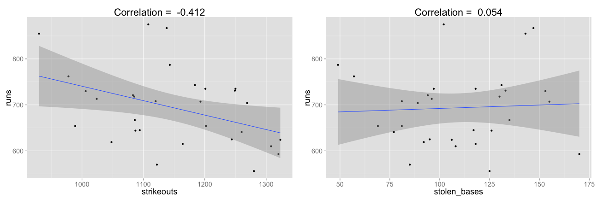

## Exploring Linear Relationships

In this presentation, we will explore the linear relationship between the Runs Scored by Baseball Teams in a season and other Team Variables, such as:

- **at_bats:** Plate appearances, not including bases on balls, being hit by pitch, sacrifices, interference, or obstruction
- **bat_avg:** batting average
- **strikeouts:** number of times that a third strike is taken or swung at and missed, or bunted foul
- **stolen_bases:** number of bases advanced by the runner while the ball is in the possession of the defense

Then, you will try to identify which variable has the strongest linear relationship with Scored Runs and hence can be best used to predict the team's Scored Runs. 

--- .class #id 

## Scored Runs vs. at_bats and bat_avg 

---

## Scored Runs vs. strikeouts and stolen_bases 

--- &radio
## Which Variable can best Predict Scored Runs?

Based on investigating the Linear Relationship between the Team Variables and the Scored Runs, which Variable can be best used to Predict Runs Scored by a Baseball team in a Season?

1. at_bats
2. _bat_avg_
3. strikeouts
4. stolen_bases

*** .hint 
Try to Explore the Linear Regression Figures and see which Variable has the strongest correlation with Scored Runs. 

*** .explanation 
The Best Variable used for Prediction is the one having the Maximum Correlation Value with Scored Runs. Based on the Previous Linear Regression Figures, the Best Variable is Batting Average (bat_avg) 

